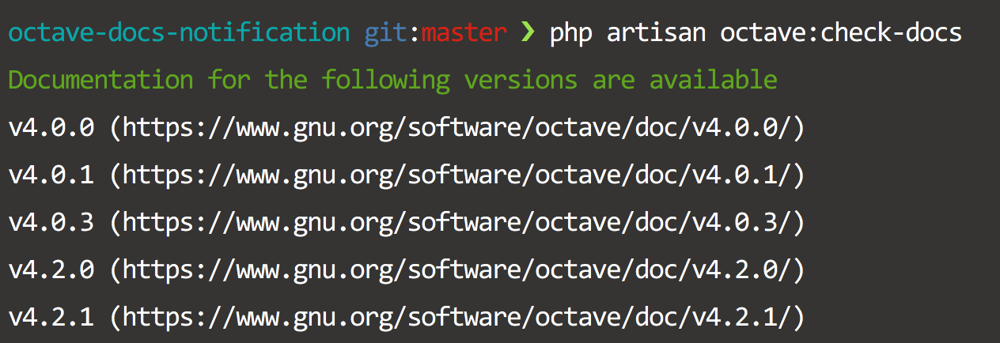

# Octave Docs Notification

In my bachelors I used [Octave](https://www.gnu.org/software/octave) for several classes and I created a [Dash](https://kapeli.com/dash) docset so I can search through the documentation offline.

Now I don't use Octave anymore and I missed some updates and did not update the docset for those who actually use it. The generation of a new docset is done quickly but the keypoint is I really don't know when new versions come out.
 
 The naive approach were to subscribe to their RSS feed. But that would mean, I have to look through them regularly to see if an update is published. I wanted something that notifies me. So I created this micro service.
 
## What is this?

This is a simple micro service, which uses Lumen as Framework. A CLI Command fetches [this site](https://www.gnu.org/software/octave/doc/) and parses the HTML. Each version number is saved to a sqlite DB. If a version is found on the page but is not in the DB an eMail is send to me to notify me that a new version is found. A cronjob triggers this command daily.

## Installation

1. Clone the repo
1. `$ composer install`
1. Copy `.env.exmaple` to `.env` and fill out variables
1. Create sqlite DB
1. Test command:

    `$ php artisan octave:check-docs`
    
1. Create (real) cronjob ([Laravel Docs](https://laravel.com/docs/5.4/scheduling)):

    `* * * * * php /path-to-your-project/artisan schedule:run >> /dev/null 2>&1`

1. Wait for new version.

## License

The Lumen framework is open-sourced software licensed under the [MIT license](http://opensource.org/licenses/MIT)
